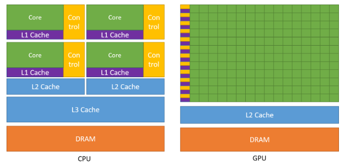
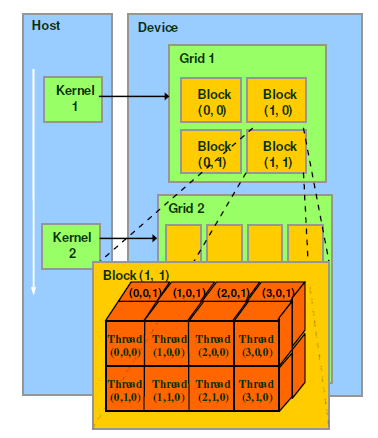
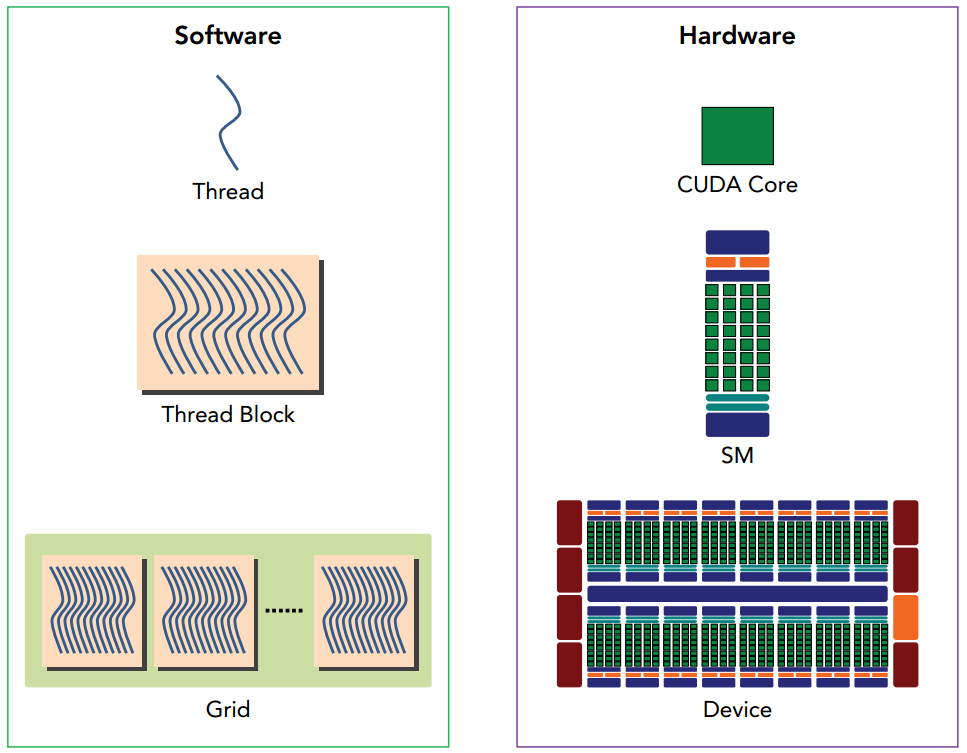

## Chapter 1: Introduction

CPU和GPU的内部的架构区别：CPU Cache大，但运算单元ALU少; GPU运算单元ALU多

## Chapter 2: Programming Model

从软件上看:
- thread: 一个CUDA的并行程序会被许多thread执行
- block: 数个thread会被群组成一个block，同一个block中的thread可以同步，也可以通过shared memory进行通信
- grid: 多个block则会再构成grid

从硬件上看:
- 一个GPU设备对应一个grid
- 一个SM(Streaming Multiprocessor)对应一个block
- 一个CUDA Core对应一个Thread

## Reference
1. CUDA官方文档 <https://docs.nvidia.com/cuda/cuda-c-programming-guide/index.html>
2. GPU高性能编程CUDA实战
3. CUDA学习系列 编译链接+运行+显存 <https://polobymulberry.github.io/categories/CUDA/>